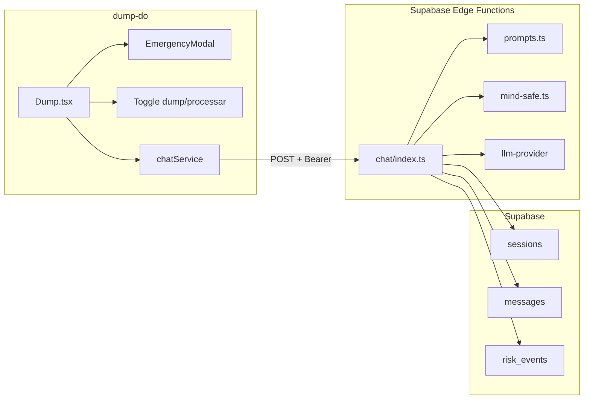

# Plano: Revisão do código para seguir [Dump.do](http://Dump.do)

## Situação atual

O frontend (`dump-do`) e o backend (`dump_do_backend`) estão desalinhados:

| Aspecto     | Frontend atual                                                        | Backend Dump.do                        |
| ----------- | --------------------------------------------------------------------- | -------------------------------------- |
| **IA**      | AMIE (chain-of-reasoning, validação + pergunta) via Gemini no cliente | Modos dump/processar via Edge Function |
| **Tabelas** | `dump_messages`, `risk_events`                                        | `sessions`, `messages`, `risk_events`  |
| **UI**      | InsightPanel (entropia, fase, emoções)                                | Modo dump vs processar                 |
| **Chat**    | `amieCore.generateAMIEResponse()`                                     | Edge Function `chat`                   |

O frontend não chama o backend de chat. O fluxo correto é o chat via Edge Function com prompts de [prompts.ts](dump_do_backend/supabase/functions/chat/prompts.ts).

---

## Arquitetura-alvo

---

## Tarefas de implementação

### 1. Corrigir vazamento no backend

No arquivo [dump_do_Dump.do_ Viabilidade de Mercado e Estratéwwwwwwwwwwwwgia.pdfbackend/supabase/functions/chat/index.ts](dump_do_backend/supabase/functions/chat/index.ts), linha 7, há um trecho que parece chave vazada no comentário. Remover essa string e deixar o comentário limpo.

### 2. Criar serviço de chat no frontend

Criar `dump-do/src/services/chatService.ts` que:

- Chama `supabase.functions.invoke('chat', { body: { message, sessionId, mode, switchMode } })`
- Envia o token via headers (`Authorization: Bearer <session.access_token>`)
- Retorna `{ message, sessionId, mode, isEmergencyResponse, riskLevel }`

### 3. Refatorar `Dump.tsx` para Dump.do

Em [dump-do/src/components/Dump.tsx](dump-do/src/components/Dump.tsx):

- **Remover** import de `amieCore` e `generateAMIEResponse`
- **Adicionar** estado `mode: 'dump' | 'processar'` e toggle na UI
- **Manter** MIND-SAFE local (`assessRisk`) como pré-cheque antes de chamar o chat (ou delegar ao backend; o backend já faz isso)
- **Substituir** o fluxo AMIE pelo novo `chatService`: enviar mensagem → receber resposta única
- **Remover** lógica de `validation` + `question` (duas mensagens); Dump.do retorna uma mensagem
- **Remover** persistência em `dump_messages`; o backend grava em `messages`
- **Usar** `sessionId` retornado pelo backend para manter sessão
- **Ajustar** `loadMessages`: buscar de `messages` filtrado por `session_id` (ou decidir se o histórico vem só do backend)

### 4. Tratar schema de banco

O backend usa:

- `sessions` (id, user_id, mode, status)
- `messages` (session_id, user_id, role, content, mode, risk_level, …)

O frontend hoje usa `dump_messages`. Há duas abordagens:

**A)** Migrar o frontend para `messages` + `sessions` (assumir que o backend já criou as tabelas).

**B)** Manter `dump_messages` e adaptar o backend para gravar/ler da mesma tabela.

Recomendação: usar o schema do backend (`sessions` + `messages`) e remover referências a `dump_messages` no frontend.

### 5. Remover/simplificar InsightPanel

O Dump.do não usa entropia/fase/emoções. Duas opções:

- **Remover** `InsightPanel` e seus imports
- **Ou** substituir por um indicador simples do modo (dump/processar) e o status MIND-SAFE

### 6. Atualizar tipos e dependências

- Em [dump-do/src/types/index.ts](dump-do/src/types/index.ts): garantir tipo `ChatMode = 'dump' | 'processar'` e interfaces alinhadas ao contrato do backend
- Em [dump-do/package.json](dump-do/package.json): confirmar `@supabase/supabase-js` nas dependências (já usada indiretamente)

### 7. Auth para Edge Function

O backend exige `Authorization: Bearer <token>`. O `supabase.functions.invoke` passa automaticamente o token se a sessão estiver autenticada. Garantir que:

- O usuário faça login antes do chat
- Ou o frontend suporte modo anônimo e o backend permita (verificar regras RLS e políticas)

---

## Arquivos impactados

| Arquivo                                                                                              | Ação                                         |
| ---------------------------------------------------------------------------------------------------- | -------------------------------------------- |
| [dump_do_backend/supabase/functions/chat/index.ts](dump_do_backend/supabase/functions/chat/index.ts) | Remover trecho suspeito no comentário        |
| [dump-do/src/services/chatService.ts](dump-do/src/services/chatService.ts)                           | Criar novo                                   |
| [dump-do/src/components/Dump.tsx](dump-do/src/components/Dump.tsx)                                   | Refatorar para Dump.do                       |
| [dump-do/src/components/InsightPanel.tsx](dump-do/src/components/InsightPanel.tsx)                   | Remover ou simplificar                       |
| [dump-do/src/types/index.ts](dump-do/src/types/index.ts)                                             | Ajustar tipos                                |
| [dump-do/src/services/amieCore.ts](dump-do/src/services/amieCore.ts)                                 | Remover ou manter só para referência         |
| [dump-do/src/constants/amie.ts](dump-do/src/constants/amie.ts)                                       | Remover se InsightPanel/AMIE forem removidos |

---

## Considerações

1. **MIND-SAFE**: O backend já faz `assessRisk` antes do LLM. O frontend pode manter o pré-cheque local para UX imediata (modal de emergência sem round-trip).
2. **Histórico**: O backend devolve o contexto via `sessionId`. O frontend pode:
  - Ou buscar mensagens de `messages` por `session_id`
  - Ou manter um estado local com as mensagens retornadas pelo chat
3. **Migração de dados**: Se existir conteúdo em `dump_messages`, definir se há migração para `messages` ou se o histórico antigo será abandonado.

